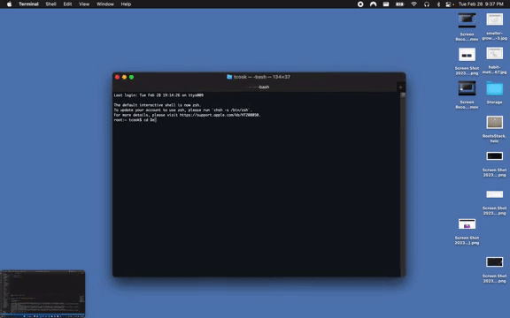

# README Generator

Project Repo: [Github-repo](https://github.com/timothymichaelcook/9-readme-generator-cook)

## Description

The focus of this project was to create a readme generator markdown file that is created by a JS file prompting users for information about their coding project, for example project name and license type. The command line application will gather all of the user inputs and insert them into a markdown file which can be used a readme file for a development project. The file will save in the root directory of the project and will end the command line application. Multiple readme files can be generated by this application which will not overwrite the previously generated file as long as the new file name is unique.

## User Story

```
- AS A developer
- I WANT a README generator
- SO THAT I can quickly create a professional README for a new project
```
## Installation

Node.js

## Usage

Users open up the a terminal window, navigate to the root of the project directory. Once at root location, run npm install to install the needed dependencies for the project. Once installed,
run npm start to run project.


## Credits

University of Richmond Coding Bootcamp

## License

MIT License

## Video Walkthrough



## Contact
Timothy Cook - timothy.michael.cook@gmail.com
